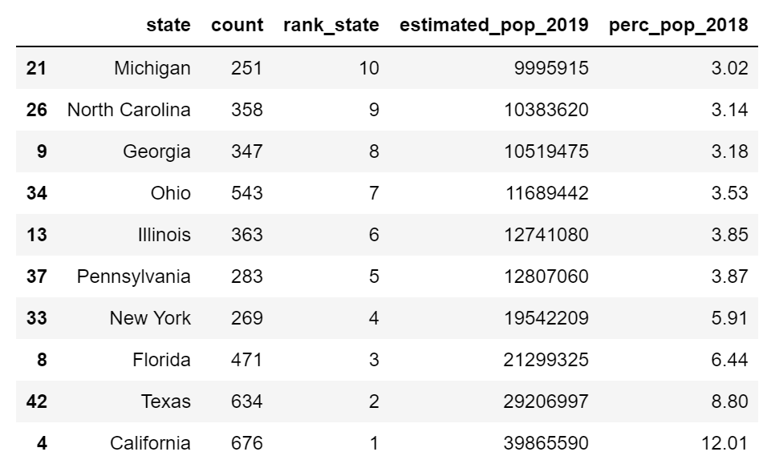

# Fast_Food - ETL Project

## Goal of the project: ETL applied to Fast Food and Population Data. 

* Data Source: 

Our first data source is from Wikipedia. We web scraped the table and transformed the data into Pandas Dataframe. 

[Population Table](https://simple.wikipedia.org/wiki/List_of_U.S._states_by_population)

Our second data source is from Kaggle. We downloaded the CSV file from the website for the Fast Food Data.  

[Fast Food Data Set](https://www.kaggle.com/datafiniti/fast-food-restaurants)

### Example of Data:

#### Extract and Transform: We select the population related data from wikipedia table and grouped by state. 

##### Then we merged with the Fast Food Data. 

##### We produced the top ten states with the most fast food restaurants after we merged the data. 

We visualized the data with a bar chart graph. 

Load: 
